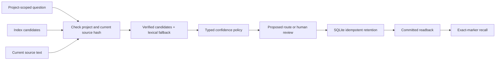

# Agent Memory & Typed Decision Demo

An executable reference for three failure modes in agent workflows: stale retrieval,
uncertain decisions, and duplicate memory writes. Built by Gustavo Payano Vasquez
to make agent-memory engineering inspectable in a five-minute interview demo.

**Python 3.10+ · standard library only · synthetic data · no API key required.**

## Run it

```sh
git clone https://github.com/lightcloud00/agent-memory-decision-demo.git
cd agent-memory-decision-demo
python3 agent_memory_demo.py
python3 -m unittest discover -s tests -v
```

The first command produces `results/demo.json`, including rejected candidates,
selected current sources, proposed decision routes, committed memory readback,
and exact-marker recall. The bundled run exercises eight contract checks.
The test suite checks failures and concurrent retries independently of that run.

## Follow one incident

1. A synthetic Cedar support question arrives with three index candidates.
2. One candidate matches current source text. One has a stale hash. One belongs
   to the Maple project. The last two cannot supply answer text.
3. Lexical fallback recovers the current Cedar runbook from canonical text.
4. Fixture probabilities produce allow/deny proposals or human review. Missing
   evidence also requires review. No proposal grants execution authority.
5. A memory entry commits to SQLite, then receives a duplicate request. Only one
   row exists. Readback and exact-marker recall prove what was actually stored.



## What the code proves

- **Freshness:** supplied candidate hashes must match current canonical sources.
  Returned content comes from those sources, not an unverified index payload.
- **Project isolation:** a source with the same identifier in another project
  cannot enter retrieval results or memory readback.
- **Explicit uncertainty:** probabilities must be finite and bounded. The policy
  proposes allow at ≥0.8, deny at ≤0.2, and review between those thresholds.
- **Idempotency:** a composite project/key constraint and serialized transaction
  make concurrent duplicate requests create one durable row. A changed payload
  under the same key raises a conflict without overwriting the original.
- **Acceptance evidence:** a successful write is followed by committed readback
  and exact-marker recall. The implementation is synchronous; it does not claim
  to model a distributed queue or asynchronous provider retention.

## Optional Jev integration

The default run uses clearly labeled fixture decisions. An optional adapter can
use an operator-managed Jev CLI without reading or printing credentials:

```sh
python3 agent_memory_demo.py --live-question "Does the supplied evidence justify escalating this synthetic support incident?" --output results/local-live.json
```

The adapter calls `jev --json ask STATE QUESTION --id decision`. It requires
explicit live mode, a resolved model, a typed boolean, a recognized verdict, and
a valid probability. Timeouts, mock responses, malformed results, or unavailable
providers surface review. They never silently substitute a fixture answer.
The repository does not configure a provider, bundle an SDK, or include secrets.
The adapter's contract is covered with mocked subprocess results; that coverage
does not prove a live provider executed. Both fixture and live proposals have
`execution_authority: none`.

## Evaluation and limits

`results/demo.json` is an actual local fixture trace. Its eight passing contracts
are software checks, not model accuracy. Its elapsed time describes one local run,
not LLM latency, throughput, or production performance. CI runs the tests and demo
on Python 3.10, 3.12, and 3.13.

This project supplies a minimal reference implementation. It does not connect to
Obsidian, Hindsight, Qdrant, or a trained System One model. Those services motivate
the contracts; the synthetic demo keeps the checks reproducible without private
notes, production infrastructure, or a model account. Lexical token overlap is
simple and explainable, but is not an embedding retrieval quality benchmark.

## Interview walkthrough

Show the stale-hash rejection and recovered runbook first. Change a canonical
source and rerun to demonstrate verification. Run the concurrency test to explain
why a submitted write differs from accepted memory. Finish by explaining what
would be needed for a production rollout: authenticated project boundaries,
balanced retrieval and decision evaluations, provider execution receipts, and
observability over real workloads.

MIT licensed. [Author's GitHub](https://github.com/lightcloud00).
